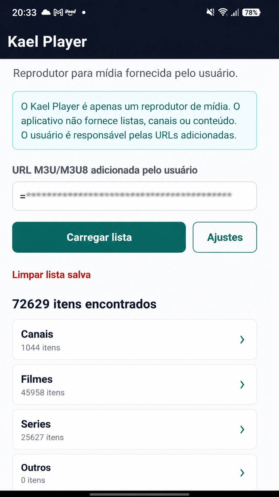

# Kael Player

> 🚧 Current Status: MVP v0.0.1



> A modern React Native media player for user-provided M3U playlists and Xtream Codes compatible services.

Kael Player is a personal side project built to explore modern mobile development, product design, prompt engineering, and AI-assisted software development.

The application is focused on learning and experimentation while following good software engineering practices.

---

# 🚀 Features

Current MVP (v0.0.1)

- ✅ Load user-provided M3U/M3U8 playlists
- ✅ Automatic Xtream Codes API detection
- ✅ Live TV support
- ✅ Movies support
- ✅ Series support
- ✅ Seasons & Episodes navigation
- ✅ Category filtering
- ✅ Search
- ✅ Local playlist persistence
- ✅ Basic native video player
- ✅ Friendly error handling
- ✅ AsyncStorage support

---

# 🏗️ Technologies

- React Native
- Expo SDK 51
- TypeScript
- React Navigation
- Expo AV
- Expo FileSystem
- AsyncStorage
- Xtream Codes API
- M3U / M3U8 parsing

---

# ⚖️ Legal Notice

Kael Player is a **media player only**.

This application **does not provide**:

- Playlists
- Channels
- Movies
- TV Series
- Streams
- IPTV subscriptions
- Copyrighted content

Users are solely responsible for the media sources and playlists they add.

This repository contains **no real playlists, credentials, copyrighted media, or streaming sources**.

---

# 📦 Installation

Clone the repository:

```bash
git clone https://github.com/YOUR_USERNAME/kael-player.git
```

Install dependencies:

```bash
npm install
```

Run the project:

```bash
npx expo start --clear
```

On Windows PowerShell:

```bash
npx.cmd expo start --clear
```

Open the application using **Expo Go** or an Android/iOS emulator.

---

# ✅ Manual Test Checklist

- Load a user-owned M3U playlist
- Load a compatible Xtream URL
- Confirm the application loads successfully
- Browse Live TV categories
- Play a Live TV channel
- Browse Movie categories
- Play a movie
- Browse Series categories
- Open seasons
- Open episodes
- Test search
- Clear the stored playlist URL
- Restart the application
- Confirm the playlist persists correctly

---

# 📁 Project Structure

```
src/
│
├── components/
├── constants/
├── navigation/
├── screens/
├── services/
├── storage/
├── types/
└── utils/
```

---

# 📌 Project Status

Current Version:

**v0.0.1**

Initial functional MVP.

Current focus:

- Stability
- Architecture
- Streaming support
- Product evolution

UI improvements will come in future releases.

---

# 🗺️ Roadmap

## v0.1.0

- Better UI/UX
- Improved player controls
- Dark Mode
- Favorites
- Recently Watched
- Better buffering handling
- Improved error messages

## v0.2.0

- Android TV support
- EPG integration
- Continue Watching
- Playback history
- Better performance

## Future

- Multi-device synchronization
- Premium features
- Cloud backup
- Automated testing
- Production release

---

# 🎯 Why this project?

Kael Player is my personal playground for learning and experimenting with modern software development.

This project allows me to improve my skills in:

- Mobile Development
- React Native
- TypeScript
- Product Design
- Prompt Engineering
- AI-assisted Development
- Software Architecture
- API Integrations
- Streaming Technologies
- Git & GitHub workflows
- Debugging
- Problem Solving

The goal isn't to compete with existing media players.

The goal is to continuously build, learn, iterate and become a better software engineer.

---

# 🤝 Contributing

Suggestions, issues and constructive feedback are always welcome.

---

# 📄 License

This project is licensed under the MIT License.
